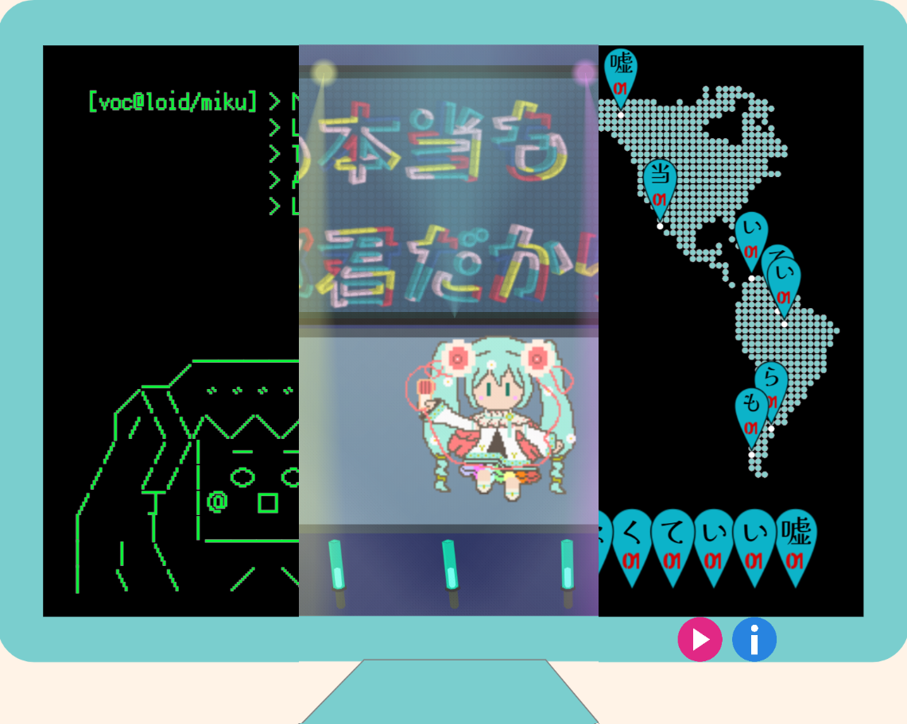

# ポリリズみっく！

**初音ミク「マジカルミライ 2021」プログラミングコンテスト**応募作品です。

「誰でも手に入れられる音楽ソフトウェア」「歌って踊るバーチャルアイドル」「世界中で愛されるグローバルアイコン」という **3 つの異なる"初音ミク像"** を、それぞれ音
楽に合わせてポップな視覚的演出によって表現しました。ミク本人が歌い踊っているような演出も盛り込んでいます。

**3 つの演出をユーザが好きなタイミングで自由に切り替えられる**ほか、出来る限り複雑な要素を減らし初見でもわかりやすく遊べる設計となっています。

『ポリリズみっく！』というタイトルには、 **「初音ミクをはじめとするピアプロキャラクターたちの様々な魅力や、私たちそれぞれが抱く多様な"初音ミク像"が重なり合って一つの音楽を奏でる」** という、この作品で表現したかったボカロ文化の魅力を込めました。

# 動作方法

`./src`フォルダ以下のファイルを HTTP サーバに設置し、`./src/index.html` を Web ブラウザで開くことで動作します。

Windows 版 Google Chrome と Microsoft Edge、及び Android 版の Google Chrome の最新バージョンにおいて動作を確認しています。

# 使用方法

- 右下の再生ボタン(▶️)を押すと楽曲が再生されます
- 右下の INFO ボタン(ℹ️)を押すと遊び方等の説明が表示されます
- 詳細は上記 INFO を参照してください

# 使用した主なライブラリ

- Text Alive App
  https://github.com/TextAliveJp/textalive-app-api
- p5.js (CDN)
  https://github.com/processing/p5.js
- p5.play (CDN)
  https://github.com/molleindustria/p5.play
